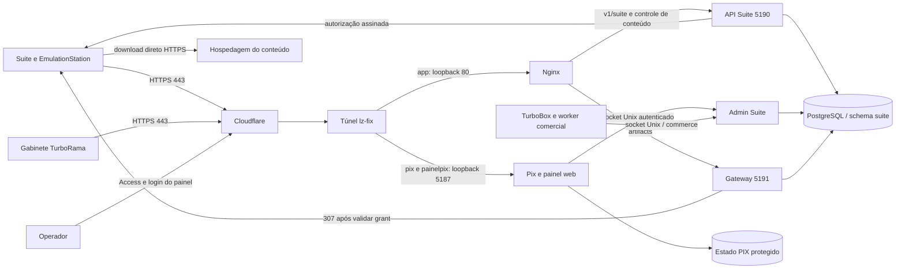
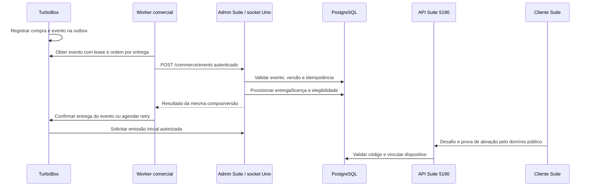

# Handoff completo — funções e operação do servidor Pix / TurboRama Suite

Data de referência: **08/09/2026**, America/Maceio, UTC−3. Inventário geral inicial às 07h; conferência do túnel às 08h48; funções, unidades, banco e tarefas reconferidos a partir das 08h58.

Documento solicitado pelo proprietário para explicar o servidor e permitir continuidade operacional. Esta entrega é documental: não implanta código, executa pagamentos, altera licenças ou reinicia serviços.

O registro do problema de conexão continua no [handoff único do incidente](HANDOFF-INCIDENTE-CONECTIVIDADE-POS-TROCA-PLACA-SERVIDOR-20260908.md). Este manual de funções não substitui esse acompanhamento nem representa correção do incidente.

## 1. O que este servidor faz

| Função | Quem utiliza | Responsabilidade do servidor |
| --- | --- | --- |
| Licenciamento dos gabinetes TurboRama | Programa instalado no gabinete | Ativar e validar máquinas, verificar provas criptográficas, controlar sessões e autorização de novas operações PIX. |
| Licenciamento TurboRama Suite | Aplicativo Windows Suite | Validar licença, vínculo e dispositivo; emitir desafios e autorizações assinadas; abrir/renovar sessões. |
| EmulationStation integrado | Aplicativo ES na mesma instalação autorizada | Reutilizar a identidade existente, com sessões separadas da Suite e reabertura controlada. |
| Venda e entrega da licença Suite | Loja TurboBox e administração | Receber eventos comerciais idempotentes, provisionar a licença, manter entrega e elegibilidade, emitir código inicial e processar transferência autorizada. |
| Administração | Operador autenticado | Consultar clientes, licenças, dispositivos, atividade, sessões e auditoria; executar ações permitidas com os controles do painel. |
| Catálogo e autorização de downloads | Suite | Entregar catálogo assinado, conferir direito de acesso e emitir autorização temporária vinculada à sessão e ao item. |
| Encaminhamento do download | Suite e hospedagem externa | Validar grant e destino protegido; redirecionar o cliente à hospedagem. O arquivo é baixado pelo cliente diretamente. |
| Inventário e presença | Suite/ES e administração | Registrar informações autenticadas de máquina/rede, histórico e último contato, sem transformar IP em identidade de licença. |
| Automação | Workers e timers | Projetar clientes da loja, processar filas comerciais, verificar conteúdo, validar candidatos, aplicar retenção e encaminhar notificações. |
| Publicação da infraestrutura | Todos os sites compartilhados | Cloudflare Tunnel, Nginx, bancos, PHP/Node e serviços de apoio. |

**Mercado Pago no gabinete:** no fluxo atual documentado, preço, Access Token, PDV, criação/consulta da cobrança, QR Code e concessão de créditos ficam no software do gabinete. O servidor de licenciamento autoriza o uso. O código preserva rotas antigas de pagamento/configuração por compatibilidade; sua existência não significa que o fluxo atual envie credenciais bancárias ao servidor.

## 2. Arquitetura e fronteiras



As portas 5187, 5190 e 5191 atendem em loopback. O socket administrativo é local. Os aplicativos recebem acesso público pela Cloudflare, sem precisar conhecer o endereço privado do servidor ou a porta do PostgreSQL.

Há dois vínculos de rede distintos: **cliente → Cloudflare** e **cloudflared → Cloudflare/origem local**. Um túnel saudável não comprova que a operadora de todo cliente alcança a borda por IPv6.

## 3. Túnel compartilhado, domínios e portas

### 3.1 Túnel efetivamente carregado

- Nome: `lz-fix`; um conector ativo, versão `cloudflared 2026.8.3`.
- Quatro conexões saudáveis, duas em `gig09` e duas em `gig11`, abertas desde 07/09 às 17:15:24–26 locais.
- Configuração **remota**, versão 15, confirmada pela API Cloudflare; os outros túneis listados estavam sem conexões.
- Unidade `cloudflared.service`, habilitada no boot; `Wants` e `After=network-online.target`; `Restart=on-failure`, intervalo de 5 s.
- Destinos são `127.0.0.1` ou `localhost`. A unidade não referencia a interface `enp4s0`, o IP LAN anterior nem `--edge-bind-address` fixo.
- Métricas/prontidão em `127.0.0.1:20241`; conexões de saída QUIC/UDP 7844 foram observadas. Portas efêmeras de saída não são portas fixas a encaminhar no roteador.

| Hostname | Destino do túnel | Função / encaminhamento seguinte |
| --- | --- | --- |
| `app.lzgames.com.br` | `http://127.0.0.1:80` | Portal; API geral; licenciamento Suite/ES; catálogo; autorizações e gateway de conteúdo. |
| `pix.lzgames.com.br` | `http://127.0.0.1:5187` | API de licenciamento dos gabinetes. |
| `painelpix.lzgames.com.br` | `http://127.0.0.1:5187` | Painel PIX e páginas administrativas Suite, protegido por Cloudflare Access. |
| `api.lzgames.com.br` | `http://127.0.0.1:80` | Virtual host próprio no Nginx; não confundir com a API Suite 5190. |
| `pma.lzgames.com.br` | `http://127.0.0.1:80` | Administração de banco via aplicação PHP existente. |
| `ponto.lzgames.com.br` | `http://127.0.0.1:80` | Sistema de ponto/PHP. |
| `suporte.lzgames.com.br` | `http://127.0.0.1:80` | Sistema de suporte/PHP. |
| `sistema2026.lzgames.com.br` | `http://localhost:80` | Nginx e aplicação PHP HTTP interna na 8091. |
| `turbobox.lzgames.com.br` | `http://localhost:8092` | Nginx dedicado e FastCGI PHP-FPM na 9083. |
| `sorteios.lzgames.com.br` | `http://127.0.0.1:8094` | Aplicação Sorteios. |

A regra final do túnel retorna `http_status:404`. Não recriar o túnel nem substituir todos os ingress ao reparar apenas uma aplicação.

### 3.2 Núcleo Pix/Suite

| Unidade / componente | Entrada local | Conta de execução | Estado observado |
| --- | --- | --- | --- |
| `nginx.service` | TCP 80/443 | Master do serviço e workers Nginx | Ativo, habilitado. |
| `turborama-pix.service` | `127.0.0.1:5187` | `turborama-pix` | Ativo, habilitado. |
| `turborama-suite-api.service` | `127.0.0.1:5190` | `turborama-suite` | Ativo, habilitado. |
| `turborama-suite-content-gateway.service` | `127.0.0.1:5191` | `turborama-suite-gateway` | Ativo, habilitado. |
| `turborama-suite-admin.service` | `/run/turborama-suite-admin/admin.sock` | `turborama-suite-admin`, grupo `turborama-suite-bff` | Ativo, habilitado. |
| `postgresql@16-main.service` | `127.0.0.1:5432` e `/var/run/postgresql` | Cluster PostgreSQL | Online, versão principal 16. |

Escuta em uma interface e permissão de firewall são verificações diferentes. A auditoria do firewall em execução encontrou entrada TCP 22/80/443 permitida, conexões estabelecidas/loopback permitidas e saída liberada. A 3306 tem regra restrita a um consumidor externo específico. Não liberar portas internas como tentativa de corrigir login público.

## 4. Versões e arquivos que realmente estão em produção

PIDs abaixo são identificação do levantamento, não constantes para scripts. Nginx, Pix e API iniciaram em 07/09 às 17:14:41 locais e continuavam com zero reinícios automáticos após esse início.

| Componente | PID observado | DLL efetiva |
| --- | --- | --- |
| API Suite | 6192 | `/opt/turborama-suite-r5-releases/es-reopen-efaf1d3-20260905/server/TurboRamaSuiteOnlineServer.dll` |
| Pix/painel | 6187 | `/opt/turborama-suite-r5-releases/es-suite-34e31f2-20260905/pix-admin/TurboRamaPixOnlineServer.dll` |
| Admin Suite | 3071 | `/opt/turborama-suite-r5-releases/es-suite-34e31f2-20260905/admin-backend/TurboRamaSuiteAdminServer.dll` |
| Gateway | 6195 | `/opt/turborama-suite-r5-releases/r5-908-gateway-policy-20260830/gateway/TurboRamaSuiteContentGateway.dll` |

Hashes SHA-256 conferidos no servidor:

```text
API:     e10bcf191c7b1c4b030427713b848a8e89af51517483d319b5979cd9ea7b07ef
PIX:     f84f3d288f94acb95d957b78e47c71f2903ef1edf5fd840f85deb5a67c4e0b06
ADMIN:   fdb7f4914218676fe5bfee7dd4b131bf9f0333a74a68389571e9f37107dfb1d3
GATEWAY: 34be13155cff5b81ad09b6c0c6c4be6afa8a40d20095bbc053667a7f7ad6dc2a
```

A API corresponde ao commit `efaf1d3cd3dfd2a807e9d5a0e7295328ff081c4a`. A referência de código/documentação Suite/ES consultada foi `eb522526547be876982f3fabb79f59fefb8fb702`, na branch `codex/emulationstation-suite-v1-20260905`.

**O `WorkingDirectory` pode apontar para um release antigo enquanto um drop-in muda o `ExecStart`.** Na API, o drop-in final observado é `zzzzz-es-reopen-20260905.conf`. Pix/admin possuem seus próprios drop-ins `zzzz-es-suite-20260905.conf`. Confirmar argumento de processo, caminho resolvido e hash; não escolher release pelo nome da pasta de trabalho.

**A main do repositório contém código PIX legado e documentos novos. Ela não é o pacote apropriado para recompilar toda a produção Suite.** Alguns READMEs ainda descrevem candidato não implantado; isso é histórico, não retrato do runtime confirmado acima.

## 5. Funções de licenciamento dos gabinetes PIX

O gabinete apresenta sua identidade e prova que possui a chave privada correspondente. O servidor mantém licença, dispositivo, perfil de proteção, ocupação, desafios, sessões e auditoria no estado PIX protegido.

Perfis descritos pelo contrato: `TPM_BOUND` e `SOFTWARE_BOUND_ONLINE`. `USB_TOKEN_BOUND` permanece reservado, sem equivaler a um pendrive comum.

| Método e rota em `pix.lzgames.com.br` | Função |
| --- | --- |
| `GET /v1/health` | Resposta de vida/prontidão do serviço; não prova uma cobrança real. |
| `POST /v1/activations/challenge` | Iniciar desafio de ativação de dispositivo. |
| `POST /v1/activations/complete` | Verificar a prova e concluir ativação autorizada. |
| `POST /v1/challenges` | Emitir desafio de uma operação protegida. |
| `POST /v1/sessions` | Validar a prova e concluir operação de sessão. |
| `POST /v1/orders` e `/v1/orders/status` | Compatibilidade histórica para criação/consulta de pagamento. |
| `POST /v1/configuration/read` e `/v1/configuration/write` | Compatibilidade histórica de configuração protegida. |

O painel permite consultar licenças/dispositivos, suspender ou reautorizar operações conforme o contrato, exigir nova autenticação e realizar transferência controlada de hardware. Transferência do **gabinete cliente** é uma operação de licença; trocar a placa do **servidor Linux** não é motivo para transferir as licenças dos clientes.

O contrato do gabinete preserva autorização local e créditos diante de perda de internet/timeout/5xx; uma negativa explícita e autenticada tem tratamento próprio. Não assumir que o mesmo comportamento offline existe para todo recurso da Suite.

## 6. Funções da API TurboRama Suite

### 6.1 Ativação, identidade e sessão

Produto `TURBORAMA_SUITE`, protocolo v1, JSON estrito e provas RSA-PSS/SHA-256. O servidor confere licença, produto, elegibilidade, vínculo, identidade, desafio, ação/contexto, validade e replay antes de emitir uma resposta assinada.

`DeviceId` deriva da chave pública do cliente. A chave CNG/TPM e o fingerprint são do computador cliente; IP público e placa do servidor não substituem essa identidade. Preservar a chave e o armazenamento da instalação ao reconectar.

| Método e rota em `app.lzgames.com.br` | Função |
| --- | --- |
| `POST /v1/suite/activations/challenge` | Desafio de ativação com o código e o descriptor do dispositivo. |
| `POST /v1/suite/activations/complete` | Concluir ativação após prova válida e consumo controlado do código. |
| `POST /v1/suite/challenges` | Desafio assinado de abertura, heartbeat ou ação autorizada. |
| `POST /v1/suite/sessions` | Abertura/renovação após verificar a prova. |
| `POST /v1/suite/devices/inventory/challenge` | Desafio para inventário autenticado da máquina. |
| `POST /v1/suite/devices/inventory` | Receber inventário e registrar resultado/histórico. |
| `POST /v1/suite/network/challenges` | Desafio específico para sinais de rede. |
| `POST /v1/suite/network/inventory` | Receber inventário complementar de rede, com escopo de aplicação. |

No código da API correspondente à implantação, desafio tem validade de 60 s, autorização de sessão de 180 s e orientação de heartbeat de 5 s. O cliente deve seguir a resposta assinada; esses valores não autorizam ignorar revogações nem garantem tolerância a qualquer reinício.

O fechamento válido da operação pode atualizar sessão, presença e outbox na transação. Não remover essas etapas para ocultar um erro SQL. O contrato comercial implementado é vitalício, um dispositivo ativo; não promover limites/políticas diferentes por edição manual de tabela.

### 6.2 EmulationStation

ES usa as mesmas duas rotas de challenge/session, com **uma ocorrência exata** do cabeçalho:

```text
X-TurboRama-Client: EMULATIONSTATION
```

Sem o cabeçalho, segue o fluxo Suite. Valor vazio, desconhecido, duplicado ou em CSV é inválido. O cabeçalho seleciona o atendimento; a autorização continua exigindo prova criptográfica. O proxy deve preservá-lo.

As rotas legadas `/v1/suite/emulationstation/challenges` e `/v1/suite/emulationstation/sessions` continuam para clientes dedicados antigos. Seus envelopes não devem ser confundidos com os do transporte compartilhado.

A correção `efaf1d3` permite nova abertura válida do ES com o vínculo existente, substituindo apenas sua sessão ES anterior do mesmo PC. A sessão Suite e as de outras identidades permanecem independentes. Não há contrato novo `session.close` nem necessidade de nova ativação a cada reabertura.

O painel tem revogação administrativa de uma sessão ES selecionada, com revalidação do alvo/versão, auditoria e idempotência. Uma confirmação antiga não deve atingir uma sessão nova. Revogar a autorização não equivale a matar instantaneamente o processo Windows.

A implantação teve smoke sintético documentado em 05/09. A homologação da reabertura com o EXE Windows existente continuava pendente no registro; CI e teste sintético não substituem esse retorno.

### 6.3 Inventário de hardware e rede

As flags declaradas pela unidade mantêm ES, inventário de máquina e inventário de rede habilitados; retenção declarada para rede: 30 dias. São dados complementares para suporte, comparação e auditoria.

IP recebido pela cadeia confiável de proxies pode mudar por DHCP, operadora ou CGNAT. MAC depende de coleta autenticada no cliente; não se obtém a MAC remota diretamente por HTTP. O painel usa representações mascaradas. Não usar IP/MAC isolados para revogar, bloquear ou reativar uma licença.

## 7. Loja TurboBox, provisionamento e entrega



O Windows utiliza a API pública 5190 por Nginx/Cloudflare; o socket administrativo é reservado aos componentes internos.

- Worker PM2: `turbobox-suite-worker`, online no levantamento.
- Script: `process-suite-outbox.php`, release TurboBox `c32ed019146123830c625299f7f8fdb009b5e4df`.
- Transporte interno: socket Unix do admin, cabeçalho `X-Suite-Commerce-Token`, distinto do token administrativo.
- O worker preserva ordem de eventos por entrega, lease, tentativas e estado de dead letter. O backend valida digest/idempotência/versão e estados financeiros. Uma fila travada não deve ser “corrigida” emitindo licenças duplicadas.

| Endpoint interno do admin | Responsabilidade |
| --- | --- |
| `POST /commerce/events` | Aplicar evento comercial de TurboBox com consistência e idempotência. |
| `GET /commerce/deliveries/{purchase}/{item}` | Consultar situação da entrega/vínculo. |
| `POST /commerce/deliveries/{purchase}/{item}/issue` | Emitir código conforme elegibilidade e operação autorizada. |
| `POST /commerce/deliveries/{purchase}/{item}/transfer` | Executar transferência controlada. |

O backend mantém `suite_commerce_inbox`, `suite_license_deliveries`, `suite_lifecycle_commands`, histórico de transferência e entitlement de conteúdo. “Pagamento”, “provisionamento”, “entrega”, “ativação” e “sessão” são estados diferentes; uma licença existir não prova conclusão de todas as etapas.

## 8. Painéis e administração

O frontend administrativo e o BFF são servidos pelo processo PIX 5187 em `painelpix.lzgames.com.br`. O backend Suite isolado usa socket Unix. Não confundir página web, BFF e backend como três portas públicas.

| Página / operação web | Função |
| --- | --- |
| `/admin/login`, `/admin` | Login e painel geral de licenças/dispositivos. |
| `/admin/clientes/{licenseId}` | Atividade do cliente, informações e sessões conforme permissões. |
| `/admin/suite` | Administração de entrega/ativação da Suite. |
| `/admin/suite/issued` | Resultado controlado da emissão; não transformar em histórico de códigos reutilizáveis. |
| `/admin/suite/actions/issue-otp` e `/admin/suite/actions/issue-first-claim` | Emissão autorizada com confirmação e auditoria. |
| `/admin/clientes/actions/revoke-es-session` | Revogar o alvo ES exato, preservando outras sessões. |
| `/admin/clientes/actions/clear-games` | Limpar o histórico de autorizações de download já encerradas, conforme o controle administrativo. |
| `/admin/suite/content` | Catálogo, disponibilidade, checks e candidatos de origem. |
| `/admin/suite/content/actions/check`, `/admin/suite/content/actions/replace`, `/admin/suite/content/actions/version` | Solicitar check, substituição de origem ou nova versão por fluxos distintos. |
| Rotas de exportação `/admin/.../audit.csv` | Exportação de auditoria autorizada e sanitizada. |

Controles: Cloudflare Access, hostname administrativo permitido, login do aplicativo, cookie protegido, CSRF, permissões por ação e step-up nas operações sensíveis. O socket exige autenticação interna e controles adicionais de ator/ação; possuir o token não substitui a autorização do operador.

`pix.lzgames.com.br/admin` não deve se tornar uma porta alternativa para o painel. As rotas máquina `/v1/*` não devem receber login HTML do Cloudflare Access.

No backend, `/sessions/query`, `/sessions/network` e `/sessions/revoke` são POSTs internos autenticados. `/health`, `/readiness` e `/readiness/content` do admin também passam pelo controle interno; uma resposta sem token não testa sua prontidão funcional.

A limpeza de histórico chama `POST /customer-activity/clear` no backend: remove apenas grants da licença nos estados `COMPLETED`, `FAILED`, `REVOKED` ou `EXPIRED` e registra `SUITE_DOWNLOAD_HISTORY_CLEARED`, incluindo a quantidade removida. A ação não apaga jogos do computador, a licença ou sessões ativas.

O painel PIX também mantém as seguintes ações POST. São operações administrativas com efeitos reais; não executá-las como sondas de diagnóstico.

| Rota administrativa PIX | Função |
| --- | --- |
| `/admin/actions/pix` | Permitir ou bloquear novas operações PIX da licença. |
| `/admin/actions/license-status` | Alterar o estado da licença PIX. |
| `/admin/actions/device-status` | Alterar o estado do dispositivo. |
| `/admin/actions/device-configuration` | Controlar a permissão de configuração do dispositivo. |
| `/admin/actions/force-reauth` | Exigir nova autenticação da licença/dispositivo selecionado. |
| `/admin/actions/create-license` | Criar licença com perfil e limite de dispositivos, emitindo código de ativação de uso único; exige step-up. |
| `/admin/actions/activation-code` | Emitir código de ativação autorizado; exige step-up. |
| `/admin/actions/device-transfer` | Preparar transferência controlada e código de uso único; exige step-up. |
| `/admin/actions/audit-purge` | Excluir auditoria antiga conforme retenção e escopo; exige step-up. |
| `/admin/actions/prices` e `/admin/actions/mercadopago` | Compatibilidade legada de preços/credencial MP; não integram o fluxo atual da interface profissional. A ação MP exige step-up. |

## 9. Catálogo, conteúdo e download direto

O readiness atual informa **902 itens esperados**, chave de assertion validada e `status:ready`. Isso não significa que todos os 902 estejam disponíveis para download: o catálogo admite disponibilidade por item e manutenção.

1. Cliente possui sessão válida e obtém o desafio da ação.
2. `POST /v1/suite-content/catalog/current` retorna catálogo/página autorizada e assinada.
3. `POST /v1/suite-content/downloads/authorize` valida licença, dispositivo, sessão, entitlement, item e contexto, emitindo grant temporário.
4. `GET /v1/suite-content/artifacts/{grantId}` chega ao gateway 5191 com bearer e contexto de retomada quando aplicável.
5. Gateway consome/valida o grant, verifica metadados e política do destino, descriptografa a origem em memória e responde **HTTP 307**.
6. O cliente baixa diretamente da hospedagem por HTTPS. Credenciais da Suite não devem acompanhar o pedido à hospedagem.

O código revisado chama `AuthorizeDirectAsync`; `StreamAsync` retorna `CONTENT_RELAY_DISABLED`. O journal do gateway em produção registra a autorização de destino direto. Portanto, não descrever esse serviço como relay/cache/armazenamento dos arquivos.

`Range` e `If-Range` fazem parte da autorização de retomada. Origens permanentes ficam cifradas; não publicar `Location`, grant, bearer, ciphertext ou URLs de hospedagem em logs/documentos. O Nginx desabilita access log na rota de artefatos deliberadamente, portanto ausência nessa rota não prova ausência de download.

O modelo de download direto tem limites documentados: o localizador chega à memória do cliente, e não há garantia de integridade dos bytes baixados por um SHA-256 oficial esperado nesse modelo. Assinatura do catálogo/autorização é uma proteção diferente de digest do arquivo. Há documentação antiga de hashing/relay no repositório; não reaplicá-la como alteração de produto sem revisar o contrato vigente.

Publisher, monitor, candidatos e janitor administram catálogo/origens/metadados. Snapshots publicados são imutáveis; alterações passam pelos fluxos de nova origem/versão e publicação transacional. Não editar um snapshot ativo nem republicar o catálogo inteiro para diagnosticar timeout de login.

## 10. Tarefas automáticas e integração WhatsApp

Um serviço `oneshot` ficar `inactive/dead` entre execuções é normal quando seu timer está ativo e a última saída foi bem-sucedida.

| Unidade / processo | Agenda efetiva observada | Função |
| --- | --- | --- |
| `turborama-suite-customer-projection.timer` | 30 s após boot; a cada 60 s | Executa `/usr/local/sbin/project-suite-admin-customers`, projetando clientes TurboBox para a visão administrativa. |
| `turborama-suite-connection-whatsapp.timer` | 30 s após boot; a cada 15 s | Consome notificações de conexão e usa a fila suportada do TurboBox. |
| `turborama-suite-content-candidate.timer` | 2 min após boot; 2 min após término, jitter até 30 s | Valida candidatos de conteúdo em fila separada. |
| `turborama-suite-content-monitor.timer` | **Diariamente às 00:00**, jitter até 5 min | Verifica saúde de origens/conteúdo. Um drop-in limpa os antigos intervalos de boot/15 min. |
| `turborama-suite-content-janitor.timer` | 10 min após boot; a cada 10 min, jitter até 1 min | Retenção e limpeza limitada de registros elegíveis. |
| `turborama-suite-content-monitor-manual.service` | Sob demanda | Check manual de um item, conforme fluxo do painel. |
| `turborama-suite-content-alert.service` | Acionamento do fluxo de conteúdo | Enfileira alertas sanitizados; não foi encontrada unit `content-alert.path`. |
| `turborama-suite-content-publisher.service` | Static, sob demanda | Publicação controlada; não é um daemon permanente. |
| `turborama-suite-content-reconcile.service` | Static, sob demanda | Reconciliação de direitos/vínculos conforme implantação. |
| PM2 `turbobox-suite-worker` | Processo contínuo | Outbox comercial, tentativas e entregas de licenças. |
| PM2 `turbobox-notifications` | Processo contínuo | Fila de notificações do TurboBox. |

Últimos resultados consultados dos timers principais eram `success`/código 0. Isso atesta execução, não entrega de toda mensagem nem validação de todos os itens.

A sessão pode atualizar `suite_device_presence` e enfileirar notificação em `suite_connection_notification_outbox`, respeitando cooldown/idempotência. Falha de entrega WhatsApp não deve invalidar a licença. Monitorar backlog, dead letter, último sucesso e códigos sanitizados; não disparar notificações reais para preencher uma matriz de teste.

## 11. Dados e configurações que precisam ser preservados

### 11.1 Armazenamentos distintos

| Armazenamento | Conteúdo | Local / identificação |
| --- | --- | --- |
| Estado PIX protegido | Licenças/dispositivos/sessões e estado legado do gabinete | `/var/lib/turborama-pix/state.json`, configuração em `/etc/turborama-pix/`; HMAC, proteção criptográfica e gravação atômica conforme implementação. |
| PostgreSQL Suite | Licenciamento, comércio, conteúdo, sessões, inventários, presença e auditoria | Cluster `16/main`, banco efetivo `postgres`, schema `suite`; dados em `/var/lib/postgresql/16/main`. |
| SQLite TurboBox | Loja, clientes, compras, entregas e outbox comercial | `turbobox.sqlite` em `TURBOBOX_DATA_DIR` ou `.data` do release; WAL habilitado. |
| Projeção administrativa | Visão derivada de clientes da loja | `suite-customers.json` privado, gerado periodicamente; não é a fonte primária de licença/pagamento. |
| MariaDB / demais bancos | Outros sistemas compartilhados | Não são o banco de licenciamento da Suite. Ver anexo de infraestrutura. |

Na instalação observada, `.data` do release TurboBox é symlink para `/home/lz-servidor/HOSTINGER SITE DOCUMENTOS/sistema2026.lzgames.com.br/public_html/turbobox/.data`. Fazer backup no armazenamento real, considerando o WAL; não assumir que copiar apenas o diretório de código preserva a loja.

Consulta PostgreSQL somente leitura confirmou **25 migrations**, última `025_suite_challenge_text_lookup`, e duas licenças `ACTIVE`/duas `REVOKED`. São contagens do instante consultado. Existe banco separado de restore histórico; não utilizá-lo como se fosse produção.

| Grupo de tabelas `suite` | Responsabilidade |
| --- | --- |
| `suite_licenses`, `suite_devices`, `suite_license_enrollments` | Direito, dispositivo e vínculo ativo. |
| `suite_challenges`, `suite_activation_completions`, `suite_sessions` | Desafios, consumo de ativação e sessões Suite. |
| `suite_es_challenges`, `suite_es_sessions`, `suite_es_session_revocations` | Sessões ES separadas e revogação por alvo. |
| `suite_commerce_inbox`, `suite_license_deliveries`, `suite_lifecycle_commands`, `suite_transfer_history` | Eventos de loja, entrega e ciclo comercial. |
| `suite_content_snapshots`, `suite_content_catalog_state`, `suite_content_items`, `suite_content_artifact_origins` | Catálogo e origens protegidas. |
| `suite_content_entitlements`, `suite_content_grants` | Elegibilidade de conteúdo e autorizações temporárias. |
| `suite_content_item_health`, `suite_content_origin_candidates`, `suite_content_monitor_state`, `suite_content_publish_runs` | Saúde, candidatos, monitor e publicação. |
| `suite_device_inventory*`, `suite_machine_change_reviews`, `suite_network_*` | Inventários e histórico complementar. |
| `suite_device_presence`, `suite_connection_notification_outbox`, `suite_content_alert_outbox` | Presença e filas de notificação. |
| `suite_audit_events`, `suite_content_management_audit`, `suite_outbox` | Auditoria/eventos internos. |
| `schema_migrations`, `schema_migration_checksums` | Evolução e integridade do schema. |

### 11.2 Configurações e segredos — somente localização

| Diretório / arquivo | Uso |
| --- | --- |
| `/etc/turborama-pix/server.env` | Estado/chaves/configuração PIX e hostname do painel. |
| `/etc/turborama-suite/server.env` e `authority.json` | Configuração da API e envelope público atual de autoridade. |
| `/etc/turborama-suite-bff/admin.env` | Socket, configuração administrativa/comercial e referências protegidas. |
| `/etc/turborama-suite-content/control.env`, `gateway.env` | Controle de conteúdo e gateway. |
| `/etc/turborama-suite-content-admin/content.env` | Módulo administrativo de conteúdo. |
| `/etc/turborama-suite-content-monitor/monitor.env` | Monitor/candidatos. |
| `/etc/turborama-suite-content-janitor/janitor.env` | Retenção. |
| `/etc/turborama-suite-content-alert/alert.env` | Integração de alertas. |
| `/etc/credstore/` | Fontes canônicas de credenciais/key rings quando configuradas; projeções privadas por `LoadCredential`. |
| `/etc/systemd/system/turborama-*.service.d/` | Drop-ins de release, módulo e integração; precedência importa. |
| `/etc/nginx/conf.d/lzgames.conf`, `lzgames-ssl.conf` e `/etc/nginx/snippets/turborama-suite-content.locations.conf` | Rotas Suite/conteúdo e consumidores compartilhados. |
| `/etc/cloudflared/`, `/home/lz-servidor/.cloudflared/` | Identidade/configuração local do conector; conferir a configuração remota efetiva. |

Flags conferidas em arquivos/unidade: `Suite__Enabled=true`, `Suite__Content__Enabled=true`, `Suite__EmulationStation__Enabled=true`, `Suite__Inventory__Enabled=true`, `Suite__NetworkInventory__Enabled=true`, retenção de rede 30 dias, `SUITE_COMMERCE_ENABLED=1`, `SUITE_CONTENT_ADMIN_ENABLED=1`. No Pix, loopback HTTP está permitido para o túnel e o host administrativo é `painelpix.lzgames.com.br`.

Não copiar conteúdo desses arquivos para chat/Git. Chaves de emissão offline, assinatura online, assertion de conteúdo, cifragem de URL/inventário, integridade do estado e peppers têm papéis distintos. Não rotacionar ou regenerar por troca de placa do servidor sem perda/corrupção comprovada e procedimento específico.

O certificado público termina na Cloudflare. A autoridade vigente confere com o SPKI público observado. O certificado HTTPS local do Nginx é outra ligação; comparar seu pin com o pin da borda produz uma conclusão errada.

## 12. Operação e diagnóstico sem alterar dados

### 12.1 Verificar processo, porta e agendamento

```bash
date --iso-8601=seconds
systemctl show cloudflared nginx turborama-pix turborama-suite-api \
  turborama-suite-admin turborama-suite-content-gateway \
  -p Id -p ActiveState -p SubState -p MainPID -p NRestarts -p UnitFileState
systemctl list-timers --all 'turborama*' --no-pager
pg_lsclusters
ss -lnt
ss -lx
cloudflared tunnel info lz-fix
```

Inspecionar unit/ambiente completo somente em sessão privada: podem conter credenciais. Ao compartilhar, manter apenas unidade, estado, PID, caminhos necessários, hash e valores não secretos.

### 12.2 Testar as camadas corretas

```bash
curl --noproxy '*' --connect-timeout 3 --max-time 6 -sS http://127.0.0.1:5187/v1/health
curl --noproxy '*' --connect-timeout 3 --max-time 6 -sS http://127.0.0.1:5190/health
curl --noproxy '*' --connect-timeout 3 --max-time 6 -sS http://127.0.0.1:5190/ready
curl --noproxy '*' --connect-timeout 3 --max-time 6 -sS http://127.0.0.1:5190/ready/content
curl --noproxy '*' --connect-timeout 3 --max-time 6 -sS http://127.0.0.1:5191/ready
curl --noproxy '*' -4 --connect-timeout 5 --max-time 8 -sS -I https://app.lzgames.com.br/v1/suite/challenges
curl --noproxy '*' -6 --connect-timeout 5 --max-time 8 -sS -I https://app.lzgames.com.br/v1/suite/challenges
```

| Resultado | Interpretação correta |
| --- | --- |
| `/health` ou `/ready` simples 200 | Processo/flag responde; não comprova login ou banco integral. |
| `/ready/content` 200 com JSON `ready` | Gate de conteúdo, catálogo e compatibilidade do pepper conferidos naquele instante. |
| GET/HEAD de rota POST retorna 405 | Transporte/encaminhamento chegou; método inadequado para autenticação. |
| POST `{}` retorna 400 `JSON_INVALID` | Parser respondeu; não é uma tentativa válida de login. |
| 404 `LICENSE_NOT_FOUND` em fixture inexistente | Consulta negativa; não valida a licença real. |
| 403/409 com código de protocolo | Investigar licença/prova/desafio/escopo/alvo conforme código e correlação. |
| 500/503 | Identificar estágio e código/SQLSTATE sanitizado; não restaurar banco por suposição. |
| Timeout antes de TCP/TLS | Investigar DNS/rede/caminho até a borda; não se resolve alterando SQL. |
| HTML 200 em saúde pública genérica de app | Pode ser o portal/fallback; não comprova saúde Suite. |
| 302 do painel público | Pode ser a proteção Cloudflare Access esperada. |

### 12.3 Localizar tentativa real do programa

Anotar início/fim com fuso, versão/caminho do EXE e mensagem. Correlacionar Nginx e API; usar CF-RAY/correlação quando existirem. A mensagem de indisponibilidade pode decorrer de `HttpRequestException` ou timeout durante sessão **ou leitura inicial de catálogo**.

```bash
journalctl -u turborama-suite-api -u turborama-pix --since '10 minutes ago' --no-pager -o short-iso
```

Inspecionar privadamente e compartilhar somente horário, método, rota sanitizada, status, duração e código genérico. O journal pode conter mais informação do que o trecho necessário. Nginx usa `/var/log/nginx/access.log`; gateway de artefatos tem política de log restrita. A ausência de auditoria de licença não equivale a ausência de tráfego HTTP.

### 12.4 Conferir banco efetivo

Usar o acesso administrativo protegido existente, com transação somente leitura e timeout. Exemplo SQL de metadados:

```sql
BEGIN READ ONLY;
SET LOCAL statement_timeout = '5s';
SELECT current_database(), current_user, pg_is_in_recovery();
SELECT version FROM suite.schema_migrations ORDER BY version;
SELECT to_regclass('suite.suite_licenses'),
       to_regclass('suite.suite_devices'),
       to_regclass('suite.suite_sessions');
COMMIT;
```

Uma consulta como administrador não prova grants do papel da aplicação. Se necessário, testar a leitura específica pelo papel runtime autorizado; não ampliar permissões para fazer um teste genérico passar. Não imprimir DSN ou material de licença.

## 13. Boot, desligamento e troca de placa-mãe

Host observado: Ubuntu 24.04.4 LTS; Xeon E5-2680 v4, 28 CPUs lógicas, cerca de 46 GiB de RAM. O hostname ainda contém `A520M-S2H`, embora a placa atual identificada seja MACHINIST X99-MR9A PRO MAX.

Após a troca, interface `enp4s0` passou a `enp6s0` e IP LAN `192.168.0.42` passou a `192.168.0.141`. NetworkManager usa endereçamento automático na conexão ativa. Manter o disco preserva arquivos, mas não garante nome/MAC/IP da interface nem relógio/TPM da placa.

Sequência de conferência após manutenção:

1. Relógio/NTP, disco/montagens, espaço/inodes, permissões e mesmos diretórios de dados.
2. Carrier, driver, interface/MAC, DHCP, rota, DNS e IPv4/IPv6 utilizáveis.
3. Cluster PostgreSQL verdadeiro e fontes protegidas de credenciais; não inicializar banco novo sobre montagem ausente.
4. Unidades, seus drop-ins efetivos e listeners/socket.
5. Túnel/configuração remota e upstreams de cada hostname.
6. Saúde local, rota pública e uma operação legítima do programa.
7. Regras de roteador/reservas DHCP e serviços presos ao endereço antigo, quando houver acesso administrativo.

A configuração atual do túnel usa loopback e não exige alterar seus destinos por causa do novo IP LAN. A falha inicial de DNS do cloudflared no boot foi recuperada automaticamente; ele ficou conectado desde 17:15. Há sessões Suite bem-sucedidas às 01:17 do dia seguinte, após a manutenção.

Não confundir troca de placa do servidor com o procedimento de transferência da máquina cliente. Não executar reativação de todos os clientes, recriar túnel, limpar sessões ou trocar chaves por esse motivo.

## 14. Backup, atualização e reversão

### 14.1 Conjunto de recuperação

Preservar em backup protegido e coerente:

- PostgreSQL Suite, schema/migrations e metadados necessários para restaurar papéis/permissões;
- estado PIX e as chaves indispensáveis para verificar/descriptografar o estado;
- SQLite TurboBox usando backup consistente com WAL, configuração e arquivos privados da loja;
- fontes de segredos/credenciais e autoridades públicas vigentes, conforme a custódia de cada chave;
- unidades/drop-ins, configuração Nginx, ingress remoto do túnel, manifestos e releases completos;
- catálogo, metadados e material protegido de publicação, sem copiar origens privadas para um repositório.

Há backups históricos e diretórios de reversão em `/var/backups/turborama-suite` e áreas privadas de evidência. **Periodicidade, cópia externa, RPO/RTO e último teste de restauração de um conjunto completo não foram comprovados nesta entrega.** Timer de backup de outro sistema ou cópia de código não equivale a backup Suite.

No levantamento, `/` era ext4, 220 GiB totais, 86% ocupado, cerca de 31 GiB disponíveis. Conferir espaço antes de build/backup/publicação; não apagar backups ou logs históricos sem política e identificação dos arquivos.

### 14.2 Atualização controlada

1. Identificar a mudança necessária, consumidores afetados e baseline por PID/caminho/hash.
2. Revisar código/configuração a partir da fonte compatível; preservar outros trabalhos locais.
3. Preparar backup e rollback do delta. Mudança em API 5190 pode atingir Suite, ES e conteúdo simultaneamente.
4. Construir/verificar pacote completo em diretório novo; executar os testes relevantes em ambiente isolado, sem dinheiro/notificações reais.
5. Aplicar somente os arquivos/unidades necessários. Validar Nginx antes de reload; usar daemon-reload somente quando unidade/drop-in mudar.
6. Verificar processo/hash, saúde e fluxo funcional; registrar o que permaneceu pendente no Windows.

Não copiar apenas uma DLL sobre o processo ativo. Não aplicar scripts históricos fixados em releases antigos nem remover suas guardas. A mera publicação de documentação no Git não atualiza o servidor.

### 14.3 Reversão

Reverter apenas o delta desta intervenção, preservando operações novas e demais aplicações. O rollback histórico correto da correção ES era específico da API; existe também um rollback antigo de três serviços que não deve ser reaplicado por engano.

Não restaurar snapshot do banco automaticamente por um 500 HTTP: isso pode eliminar compras/sessões posteriores. Não executar migrations `down` em massa. Para rede, preparar acesso local/console e reversão antes de uma alteração que possa cortar a sessão.

## 15. Estado do incidente de acesso em 08/09

**Aberto; sem correção efetiva implantada nesta investigação.**

- O programa usa `https://app.lzgames.com.br:443`; a API interna está na 5190.
- IPv4 alcançou a API com certificado/pin atuais válidos. IPv6 falhou por timeout tanto em app quanto em Google/Cloudflare, no Linux e nas sondas Windows.
- O túnel manteve quatro conexões e as portas não mudaram. Tracepath chegou ao roteador e aos primeiros saltos da operadora; a causa exata do defeito IPv6 ainda não foi localizada.
- Última sessão real confirmada nos registros anteriores: 08/09 às 01:17:10 locais. Sondas feitas depois não equivalem a login do executável.
- Foi tentada a opção por registro `settings.ipv4_only=true`, com backup e reversão preparados. Cloudflare recusou HTTP 400/código **9227**, recurso indisponível nesta zona. Releitura integral dos 40 registros DNS comprovou ausência de mudança.
- A credencial permite DNS Read/Write e Zone Read; a limitação 9227 não deve ser descrita como falta genérica de token DNS.
- O acesso administrativo ao roteador continua pendente. Uma janela Claro foi preparada, mas às 08h49 já estava fechada; não presumir sessão autenticada disponível.

Continuidade: atuar no ponto de rede demonstrado, preservar o EXE/identidade e validar challenge, sessão, heartbeat e catálogo reais. A abertura do manual não autoriza repetir uma alteração rejeitada nem declarar o incidente resolvido.

## 16. Outros consumidores do mesmo host

Este inventário explica dependências compartilhadas e impacto de manutenção; não transforma problemas de outro sistema em causa do login Suite.

| Componente | Porta/socket de referência | Papel / observação |
| --- | --- | --- |
| API LZGames | 8083 | Node/API do aplicativo e marketplace, publicada por Nginx. |
| Sistema2026 | 8091 | Aplicação PHP HTTP; PM2 `sistema2026-homolog`. |
| TurboBox público | 8092 → FastCGI 9083 | Nginx/PHP-FPM dedicados; loja e integrações Suite. |
| TurboBox LAN | Bind histórico na 8092 do IP antigo | Falhou por endereço removido na auditoria das 07h; às 09h, PM2 `turbobox-lan` estava **stopped**. Não foi parado por esta entrega; não afirmar que o loop continua ativo. |
| Sorteios | 8094 | Aplicação e worker WhatsApp próprios. |
| Chat V2 / gateway MenuIA | 3213 / 3214 | Serviços de usuário; modo menuOnly observado, gateway publicado no webhook específico. |
| Segunda via antiga | 3210 configurada | Backend parado na auditoria; `/api/second-copy/` retornou 502. Não migrar cegamente para 3213. |
| Chat piloto / Ollama | 3212 / 11434 configuradas | Desativados no inventário; o menu atual não depende de instanciar Ollama. |
| Barbearia local | 8095 configurada | App/túnel local desativados; worker WhatsApp observado online. |
| PHP geral | `/run/php/php8.3-fpm.sock` | Ponto, suporte, phpMyAdmin, Preço Certo, Crediário e outras páginas. |
| MariaDB principal | 3306 / socket mysqld | Banco de outras aplicações; regra externa restrita. |
| MariaDB de homologação chat | 3310 | Instância local separada. |
| Redis / Memcached | 6379 / 11211 | Serviços locais de apoio; não inferir uso pela Suite só por estarem ativos. |
| SSH | 22 | Administração. |
| Samba | TCP 139/445, UDP 137/138 | Compartilhamento/descoberta; presença de listener não prova liberação no firewall. |
| DNS local / CUPS / mDNS | 53 / 631 / UDP 5353 | Infraestrutura local, impressão e descoberta. |

`db.lzgames.com.br` foi observado apontando para o IPv4 público informado pelo proprietário. A cópia de configuração externa de Sistema2026 usa porta 23306; isso depende de encaminhamento do roteador, cuja tabela não foi inspecionada. A Suite continua usando PostgreSQL local e não depende desse hostname/encaminhamento MariaDB.

Portas de prévia de desenvolvimento são temporárias e não fazem parte do contrato de produção. Outros agentes/trabalhos estavam ativos no host; não encerrar processos ou trocar releases de outros projetos durante uma manutenção Pix.

## 17. Critérios de aceite e continuidade

| Frente | Prova para declarar funcionamento |
| --- | --- |
| Conectividade | TCP/TLS, certificado/pin e protocolo na rede afetada; IPv4/IPv6 e controles adequados; contraprovas externas quando disponíveis. |
| Suite existente | Mesmo EXE/identidade: challenge, sessão, heartbeat e catálogo assinado aprovados. |
| ES | Abrir/sair/reabrir, coexistência Suite/ES e isolamento entre clientes. |
| Licenciamento inválido | Negativas continuam válidas; reparo não libera licença/dispositivo não autorizado. |
| Loja | Evento comercial idempotente e entrega consistente, usando fixture/ambiente autorizado. |
| Conteúdo | Catálogo, autorização, redirecionamento permitido e download/retomada no cliente conforme contrato direto. |
| Administração | Access/login/CSRF/permissões, consulta e ações no alvo correto; sem vazamento de dados protegidos. |
| Filas | Execução, backlog/dead letter e idempotência; sem mensagens sintéticas reais. |
| Persistência | Configuração efetiva preservada e teste de boot na janela apropriada, ou pendência explícita. |

O histórico contém testes de carga em CI, mas não comprova SLA/capacidade atual do host. Preservar pools e limites existentes; não elevar globalmente conexões PostgreSQL ou remover rate limits por causa de timeout anterior ao TLS.

Para retomar o trabalho, ler este manual e o incidente original, identificar o baseline atual, resolver apenas o bloqueio demonstrado e atualizar o registro com mudança, testes, reversão e pendências. Não reexecutar todo o histórico de implantações.

## 18. Referências e evidências

- [Incidente e retorno operacional](HANDOFF-INCIDENTE-CONECTIVIDADE-POS-TROCA-PLACA-SERVIDOR-20260908.md).
- [Código Suite/ES e documentação na referência revisada](https://github.com/luziellacerda/Servidor-pix/tree/eb522526547be876982f3fabb79f59fefb8fb702).
- [Implantação e reabertura ES](https://github.com/luziellacerda/Servidor-pix/blob/eb522526547be876982f3fabb79f59fefb8fb702/docs/suite/HANDOFF-EMULATIONSTATION-ROTAS-COMPARTILHADAS-20260905.md).
- [Evidência da DLL API implantada](https://github.com/luziellacerda/Servidor-pix/blob/eb522526547be876982f3fabb79f59fefb8fb702/docs/suite/evidence/es-reopening-deployment-20260905.json).
- [Contrato do painel de conteúdo](https://github.com/luziellacerda/Servidor-pix/blob/eb522526547be876982f3fabb79f59fefb8fb702/docs/suite/CONTENT-ADMIN-BFF-CONTRACT.md); consultar junto do runtime e dos overrides atuais.
- [Modelo de download direto e limites documentados](https://github.com/luziellacerda/Servidor-pix/blob/eb522526547be876982f3fabb79f59fefb8fb702/docs/suite/DIRECT-DOWNLOAD-ACCEPTED-RISKS-R2.md).
- Evidências locais: `/home/lz-servidor/evidence/diagnostico-licenciamento-20260908/`, `/home/lz-servidor/evidence/ecossistema-portas-20260908/` e `/home/lz-servidor/evidence/reparo-suite-20260908/`. Os snapshots administrativos permanecem privados.
- Memória de retomada do chat: `/home/lz-servidor/RETOMAR-REPARO-TURBORAMA-PIX-20260908.md`.

Nesta entrega foram lidos código e configuração, consultadas unidades/PM2/timers, metadados PostgreSQL em modo somente leitura e prontidão local. Não foram executados novos testes autenticados completos, restore, build, deploy, cobrança, ativação ou envio de mensagens. O manual distingue função implementada, observação operacional e aceite ainda pendente.
